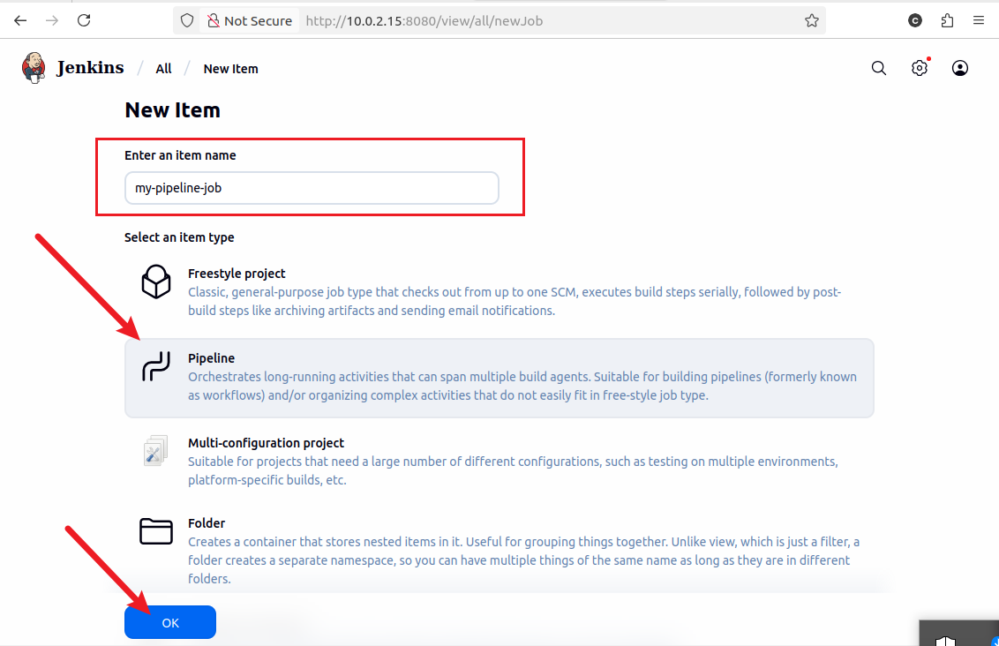
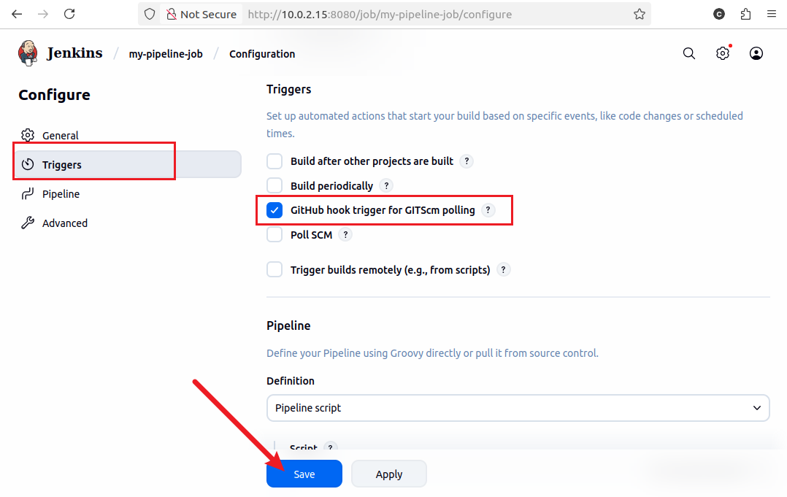
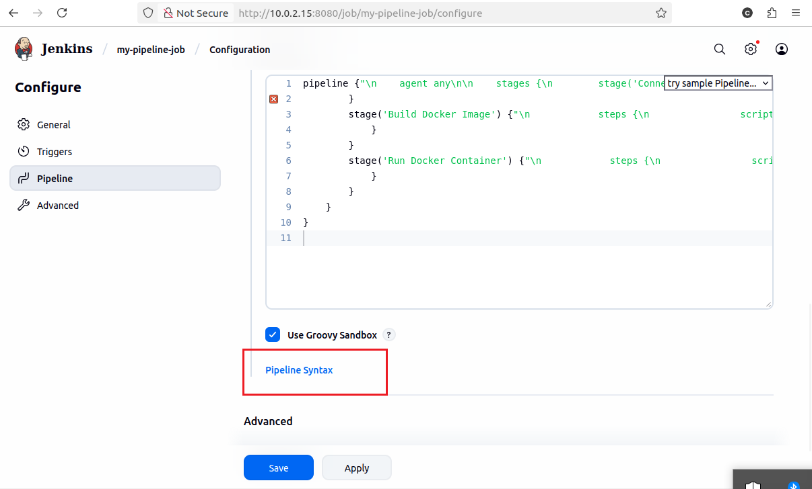
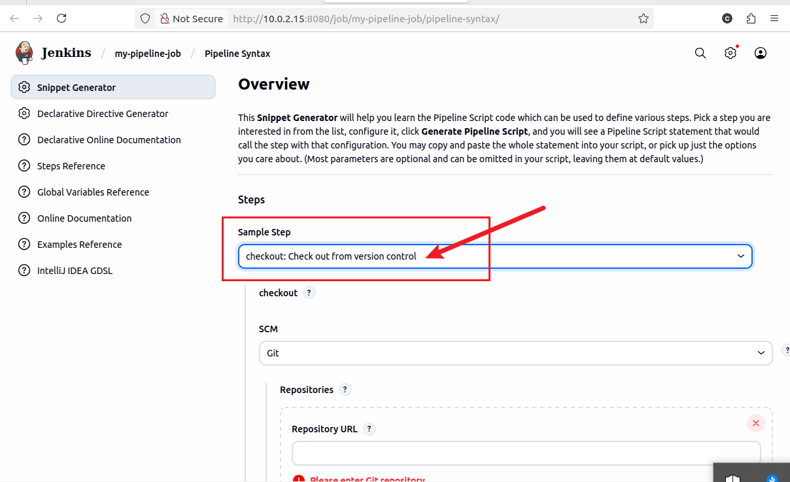
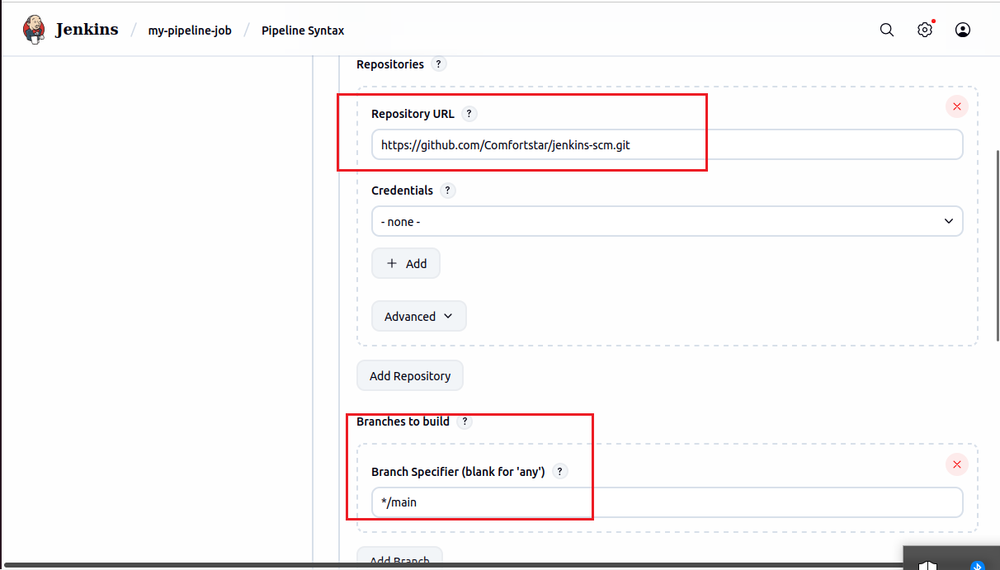
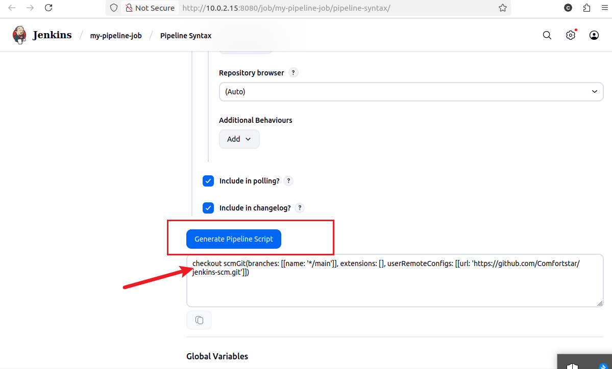
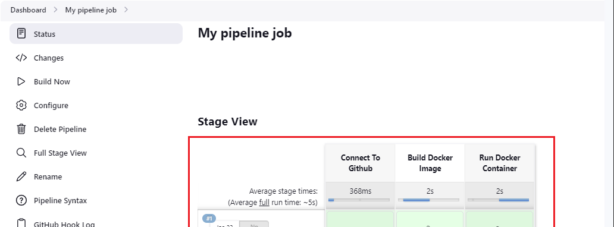
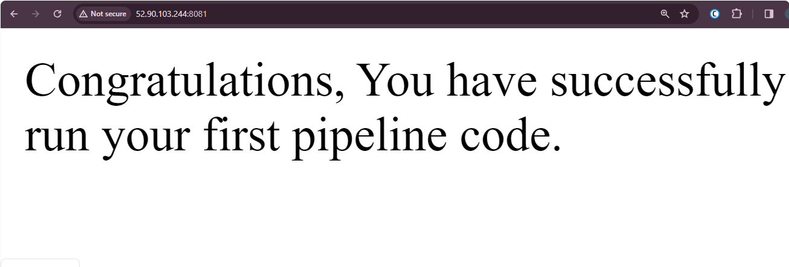

# Jenkins-pipeline-jobs

A Jenkins pipeline is a way to define and automate a series of steps in the software delivery process. It allows you to script and organise your entire build, test, and deployment. Jenkins pipelines allow organisations to define, visualize, and execute processes as code. 

### Creating a pipeline job:

i. Click on new item from the dashboard menu

ii. Create a pipeline job and name it "my-pipeline-job"

### Configuring build trigger

Create a build trigger for jenkins to trigger new build.

i. Click "configure" your job and add this configurations.

ii. click on build trigger to configure triggering the job from GitHUb Webhook. 

### Writing Jenkins pipeline scripts

A Jenkins pipeline scripts refer to the scripts that defines and orchestrates the steps and stages of continuous intergration and continuous delivery pipeline. Jenkins pipeline can be defined using a declarative or scripted syntax. Declarative syntax is more structured and concised way to define pipeline. It uses a domain-specific language to define the pipeline stages, steps and other configurations. While scripted syntax provides more flexibility and is suitable for complex scripting requirement. 

PIPELINE SCRIPT:

~~~~
pipeline {"\n    agent any\n\n    stages {\n        stage('Connect To Github') {\n            steps {\n                    checkout scmGit(branches: [[name: '*/main']], extensions: [], userRemoteConfigs: [[url: 'https://github.com/RidwanAz/jenkins-scm.git']])\n            "}
        }
        stage('Build Docker Image') {"\n            steps {\n                script {\n                    sh 'docker build -t dockerfile .'\n                "}
            }
        }
        stage('Run Docker Container') {"\n            steps {\n                script {\n                    sh 'docker run -itd -p 8081:80 dockerfile'\n                "}
            }
        }
    }
}
~~~~

### Explanation of script above:

* Agent Configuration:
   
   ``agent any``

   Specifies that the pipeline can run on any available agent (an agent can be a jenkins master or node). This means the pipeline is not tied to a specific node type.

 * Stages:

    ~~~~
    stages {"\n      // Stages go here\n   "}
    ~~~~
Defines the various stages of pipeline, each representing a phase in the software delivery process. 

* ### Stage 1: Connect to GitHub

  ~~~~
   stage('Connect To Github') {"\n      steps {\n         checkout scmGit(branches: [[name: '*/main']], extensions: [], userRemoteConfigs: [[url: 'https://github.com/Comfortstar/jenkins-scm.git']])\n      "}
   }
   ~~~~

* This stage checkout the source code from Github repository "https://github.com/Comfortstar/jenkins-scm.git"
* It specifies that the pipeline should use the "Main" branch.
* ### Stage 2: Build Docker image:
  
  ~~~~
  stage('Build Docker Image') {"\n      steps {\n         script {\n            sh 'docker build -t dockerfile .'\n         "}
     }
   }
   ~~~~

*   This stage build a Docker image named "dockerfile" using the source code obtained from the Github repository. 
*   The "docker build" command is executed using the shell "sh"
  
  * ### Stage 3: Run Docker Container:
  
  ~~~~
  stage('Run Docker Container') {"\n      steps {\n         script {\n            sh 'docker run -itd --name nginx -p 8081:80 dockerfile'\n         "}
   }
}

  ~~~~
  * This stage runs a docker container named "nginx" in detached mode (`-itd`)
  * The container is maaped to port 8081 on host machine (``-p 8081:80``)
  * The docker image used is the one built in the previous stage (``dockerfile``).
  
### Copy the pipeline script and paste it in the section below

The stage 1 of the script connectds jenkins to Github repository. To generate syntax for your Github repository, follow the steps below

i. Click on the pipeline syntax

ii. Select the drop down to search for "checkout: to check out from version control"

iii. paste your repository url and make sure your branch is main.

iv. Generate your pipeline script

Now you can replace the generated script to connect jenkins with github.

NOTE: Before Jenkins can run Docker command, docker needs to be installed on the same instance jenkins is installed. 

### BUILDING PIPELINE SCRIPT

A docker file needs to be created before we can run our pipeline script.

In the main branch on jenkins-scm:

i. Creat a new file name dockerfile
ii. Paste the code snippet below in the file.

~~~~
# Use the official NGINX base image
FROM nginx:latest

# Set the working directory in the container
WORKDIR  /usr/share/nginx/html/

# Copy the local HTML file to the NGINX default public directory
COPY index.html /usr/share/nginx/html/

# Expose port 80 to allow external access
EXPOSE 80

~~~~
iii. Create an "index.html" and paste content below.

~~~~
Congratulations, You have successfully run your first pipeline code.

~~~~

Pushing this dockerfile and index.html will trigger jenkins to automatically run new build for our pipeline 

Edit the inbound rule and open the port 8081 we mapped our container, to be able to access the content on index.html on the web browser. 

using ``https://jenkins-ip-address:8081``, the content on index.html can be access on the browser

